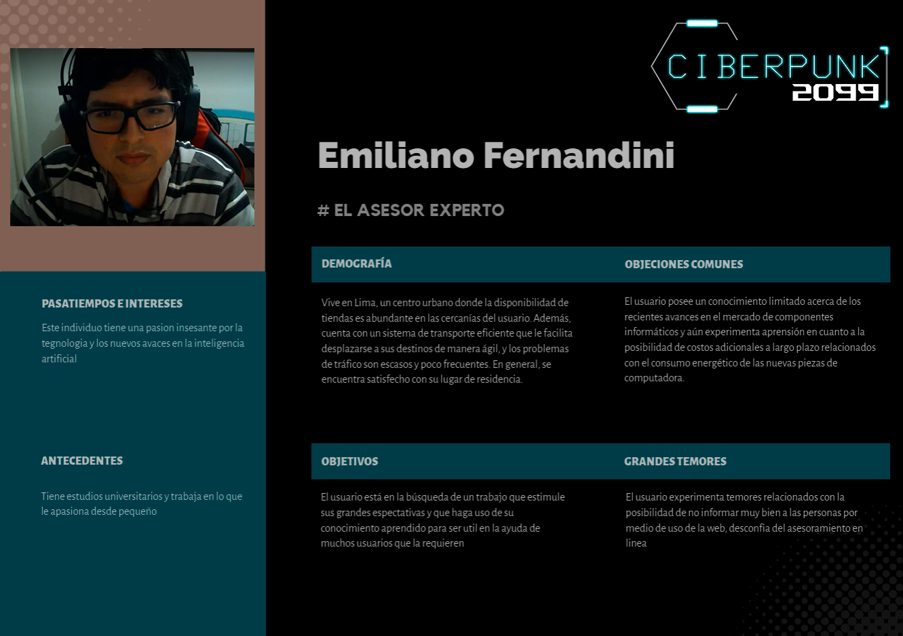
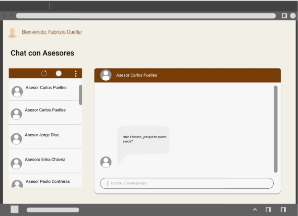

# Capítulo I: Introducción
## 1.1. Startup Profile
### 1.1.1. Descripción de la Startup
Nuestro Startup *Ciberpunk 2099*, conformada por estudiantes de la facultad de Ingeniería de la UPC, tiene como propósito crear una aplicación web que asesore al usuario en la adquisición de componentes de computador de acuerdo a sus necesidades y compatibilidad con otros componentes. 

Misión: Nuestra misión es ofrecer una amplia gama de productos y componentes de acuerdo a la necesidad del usuario, tanto para trabajo profesional o videojuegos.

Visión: Nuestra visión es ser la marca Líder en venta de componentes con una reputación sólida y confiable para el mercado.

### 1.1.2. Perfiles de integrantes del equipo

**Mariano Alejandro Vilela Menéndez**

Mi nombre es Mariano Alejandro Vilela Menéndez, soy estudiante de la carrera de Ingeniería de Software en la Universidad Peruana de Ciencias Aplicadas. Me considero una persona comprometida y responsable al momento de realizar trabajos. Soy bueno trabajando bajo presión y en quipo. En este trabajó aportaré con los conocimientos que adquirí en los anteriores cursos de la carrera, de tal manera el equipo podrá realizar un buen trabajo durante el transcurso del curso actual.


**Rodrigo Alejandro Raymundo Guevara**

Mi nombre es Rodrigo Raymundo Guevara, tengo 22 años. Cuento con conocimientos en Java, Spring Boot, Angular, C++ y Python. Fuera de lo académico me gusta jugar videojuegos y ver peliculas. 


**Fabrizio Torres Solano**

Mi nombre es Fabrizio Torres Solano, estudio ingeniería de software 
en la Universidad Peruana de Ciencias Aplicadas. Me considero una 
persona responsable, generosa, hábil y competitiva.En el trabajo que 
me encuentro realizando, ayudaré a dar ideas para poder desarrollar 
de la manera óptima el trabajo y aportar si es que alguien solicita 
ayuda.


Breve Descripcion

**Edery Renzo Abanto Vicente**

Soy un estudiante universitario enfocado en el desarrollo de programación, con 
experiencia en Python, C++, SQL, C#, MATLAB y programación orientada a objetos. 
También tengo habilidades avanzadas en Excel y un nivel intermedio de inglés. Mi 
objetivo es crecer en el campo de la inteligencia artificial y el aprendizaje automático, 
alcanzando mis metas y encontrando satisfacción en mi carrera profesional


**Gianfranco Luna Morales**

Me gusta observar el comportamiento de las personas para así crear un ambiente cómodo y activo; 
soy práctico y racional para los percances que puedan surgir. Si bien poseo conocimientos básicos 
en la programación en el lenguaje C++, aportaré en lo que pueda para realizar con éxito la idea planteada.


## 1.2. Solution Profile
Nuestra aplicación web llamada CyberPunk, está basada en brindar ayuda y
resolver dudas sobre el hardware y software de la computadora o laptop, a
consecuencia de la falta interés para informarse sobre los componentes del pc
o laptop cuando piensan renovar o comprar el equipo. Además, nuestro
objetivo al crear este proyecto es solucionar una necesidad que con el pasar de
los años ha ido en crecimiento, ya que ahora muchas personas compran sus
computadoras a ciegas por falta de conocimiento.
### 1.2.1. Antecedentes y problemática 
En el contexto de este proyecto, se busca abordar la problemática de la falta de información y la dificultad que enfrentan las personas al comprar componentes de computadoras y ensamblar sus propios sistemas. Para muchos, esta tarea puede resultar abrumadora debido a la diversidad de opciones disponibles y la necesidad de asegurarse de que los componentes sean compatibles entre sí.

**Antecedentes:**

En el mercado actual, la compra de componentes de computadoras es una tarea desafiante para aquellos que no tienen un profundo conocimiento en la materia. Las personas pueden encontrarse con los siguientes problemas:

1. **Falta de Conocimiento:** Muchos usuarios carecen de conocimientos técnicos y no saben qué componentes son compatibles o adecuados para sus necesidades.

2. **Gasto Desinformado:** La falta de información puede llevar a gastos innecesarios o a la compra de componentes que no se ajustan a las necesidades del usuario.

3. **Barreras en el Ensamblaje:** El proceso de ensamblaje puede ser intimidante, lo que desanima a algunas personas a intentarlo por sí mismas.

4. **Falta de Información sobre el Rendimiento:** Los usuarios a menudo no tienen una idea clara de cómo funcionarán sus sistemas en términos de rendimiento, ya sea para juegos, programas de diseño, o cualquier otro uso.

5. **Consumo de Energía Desconocido:** No entender el consumo de energía puede resultar en gastos más altos de electricidad y posibles problemas de alimentación.

•	What (Qué) ¿Cuál es el problema?

La problemática que aborda este proyecto se resume en los siguientes puntos:

- **Dificultad para Elegir Componentes:** Los usuarios enfrentan dificultades para seleccionar componentes compatibles y adecuados para sus necesidades específicas.

- **Desperdicio de Recursos:** Se producen gastos innecesarios debido a compras de componentes incompatibles o inadecuados.

- **Falta de Confianza en el Ensamblaje:** La falta de conocimiento y confianza impide que algunas personas ensamblen sus propios sistemas, lo que podría ser una experiencia gratificante.

- **Falta de Información sobre el Rendimiento:** Los usuarios desean tener una idea clara de cómo funcionará su sistema antes de realizar una compra costosa.

- **Problemas de Consumo de Energía:** El desconocimiento sobre el consumo de energía puede llevar a costos adicionales y preocupaciones ambientales.

•	When (Cuándo) ¿Cuándo sucede el problema?

El problema sucede cuando el usuario se contacta son un tecnico o contacto de ensamblaje, consumen su tiempo tratando de entender cuál sería las piezas óptimas, así mismo, la posibilidad de ser estafados ante un aumento de precios.

•	Where (Dónde) ¿Dónde ocurre el problema?

La problemática ocurre en los centros de trabajo o en los hogares, ya que los componentes pueden volverse obsoletos y requeiren una actualizacion.

•	Who (Quién) ¿Quién es afectado por el problema?

El problema lo tienen las personas que optan por actualizar tu ordenador o conseguir componentes nuevos sin estar informados del mercado o de las especificaciones de estos.

•	Why (Por qué) ¿Por qué ocurre el problema?

El problema sucede porque no se contacta a un asesor confiable y de calidad, el cual no posee la experiencia o se aprovecha de la ignoracia del cliente, por lo que este termina accediendo ante los precios o información brindada del asesor en cuestión.

•	How (Cómo) ¿Cómo resolver el problema?

La solución propuesta es desarrollar una página web que aborde estas problemáticas proporcionando las siguientes funcionalidades:

- **Simulación de Ensamblaje:** Los usuarios podrán ensamblar virtualmente sus sistemas y verificar la compatibilidad de los componentes.

- **Cálculo de Gastos:** La página calculará automáticamente el costo total de los componentes seleccionados.

- **Predicción de Rendimiento:** Los usuarios obtendrán estimaciones de rendimiento en términos de fps en juegos y aplicaciones, como AutoCAD.

- **Información sobre Consumo de Energía:** La página mostrará el consumo de energía estimado y ofrecerá recomendaciones para una eficiencia óptima.

- **Comparación de Precios:** Los usuarios podrán comparar precios de componentes en diversas tiendas en línea.

Esta solución busca empoderar a los usuarios con la información necesaria para tomar decisiones informadas al comprar y ensamblar componentes de computadoras, mejorando así su experiencia y confianza en el proceso.

•	How much (Cuánto) ¿Cuánto costaría resolver el problema?


### 1.2.2.Lean UX Process

- **Dominio:** Desarrollo de soluciones en línea para la compra y ensamblaje de componentes de computadoras.
- **Segmentos de Clientes:** Usuarios interesados en comprar componentes de computadoras, incluyendo gamers, ingenieros, y otros.
- **Puntos de Dolor:** Falta de información sobre la compatibilidad de componentes, desconocimiento del costo total y consumo de energía, y dificultad para entender el rendimiento en aplicaciones específicas como juegos y software de diseño.
- **Brecha:** El mercado carece de una plataforma que proporcione información completa y personalizada sobre la compra y ensamblaje de componentes de computadoras.
- **Visión/Estrategia:** Facilitar a los usuarios la toma de decisiones informadas al comprar y ensamblar componentes de computadoras.

#### 1.2.2.1. Lean UX Problem Statements

1. Los usuarios que desean ensamblar su propia computadora enfrentan dificultades para encontrar componentes compatibles y entender su costo total.
2. Los usuarios carecen de información sobre el rendimiento de su sistema en aplicaciones específicas como juegos y software de diseño.
3. Los usuarios necesitan conocer el consumo de energía de su sistema y recibir recomendaciones para una eficiencia óptima.

#### 1.2.2.2. Lean UX Assumptions

- Suponemos que los usuarios estarán dispuestos a utilizar una plataforma en línea para ensamblar virtualmente sus computadoras.
- Suponemos que la información proporcionada sobre compatibilidad, costo, rendimiento y consumo de energía será valiosa para los usuarios.

#### 1.2.2.3 Lean UX Hypothesis Statements

1. Creemos que al proporcionar una simulación de ensamblaje y estimaciones de rendimiento en nuestra plataforma en línea, los usuarios se sentirán más seguros al comprar componentes y ensamblar sus propias computadoras, lo que resultará en un aumento del 20% en la participación de usuarios activos en el primer trimestre.
2. Creemos que al ofrecer información sobre el consumo de energía y recomendaciones para la eficiencia, los usuarios reducirán su consumo de energía en un 15% en el primer año.

#### 1.2.2.4. Lean UX Canvas

### 1.3. Segmentos objetivo
Nuestro segmento objetivo está dirigido principalmente a hombres y mujeres de 15 a 30 años, residentes en la ciudad de Lima, que deseen adquirir o actualizar una computadora, laptop o componente específicamente para el fin previsto. Además, nuestra aplicación web ayudará principalmente a personas con poco conocimiento de hardware y software así como su importancia en la selección de equipos de procesamiento que se ajusten a su presupuesto. Por otro lado, te ahorraremos tiempo, dinero y sobre todo la seguridad de tu compra, evitando posibles fraudes.
## Capítulo II: Requirements Elicitation & Analysis 
### 2.1. Competidores
Hemos podido identificar a varios competidores que ya llevan mucho tiempo en
el mercado, ya que se posicionaron en el mercado por las publicidades, ofertas
y recomendaciones de sus clientes, como principales tenemos a los centros
comerciales, como falabella, oeschle, curacao, efe y otros centros que tienen
asesores dentro de su tienda. Para contrarrestar esto, pensamos hacer
publicidad por las redes sociales y trabajar con tiendas pequeñas.

● Falabella es una tienda física que ofrece una amplia variedad de
productos electrónicos, y tienen asesores que los ayudan en caso no tengan idea de que comprar, así como otros productos relacionados con el
hogar y la moda. Se diferencian de las otras dos empresas en que tienen
asesores dentro de la tienda que pueden brindar información detallada
sobre los productos y ayudar a los clientes a tomar decisiones de compra.

● PC Building Simulator es una aplicación educativa que permite a los
usuarios aprender a armar una computadora y conocer los diferentes
componentes que se utilizan en la construcción. Se enfoca en la
educación y el aprendizaje, y su objetivo principal es ayudar a los
usuarios a comprender mejor cómo funcionan las computadoras y cómo
se ensamblan.

● Core Gaming, por otro lado, es una plataforma en línea que permite a los
usuarios construir su propia computadora desde cero. Ofrece una
experiencia de compra personalizada en la que los usuarios pueden
elegir los componentes que desean utilizar y armar su propia
computadora de acuerdo con sus necesidades y presupuesto

En términos de estrategias de mercado, Falabella y otros centros comerciales
han utilizado principalmente publicidad tradicional y asesores en la tienda para
atraer a los clientes. En cambio, PC Building Simulator y Core Gaming han
utilizado principalmente herramientas digitales, como aplicaciones y
plataformas en línea, para llegar a su público objetivo.
En resumen, estas tres empresas se diferencian en la forma en que ofrecen
sus productos y servicios, así como en sus estrategias de marketing. Cada una
de ellas tiene su propio enfoque y ofrece beneficios únicos a sus clientes.
#### 2.1.1. Análisis competitivo
#### 2.1.2. Estrategias y tácticas frente a competidores
Tras un análisis minucioso de nuestros principales competidores, hemos
establecido las siguientes estrategias:
1. Ampliar las pruebas gratuitas con mayor variedad de funciones.
2. Prestar atención detallada a las reseñas y calificaciones de nuestra aplicación.
3. Ofrecer la mayor compatibilidad y soporte posible con diferentes dispositivos y redes.
4. Garantizar atención personalizada a través de nuestra plataforma virtual.
5. Crear una página web oficial para nuestra empresa.
6. Establecer un canal de atención al cliente fácilmente accesible

### 2.2. Entrevistas
#### 2.2.1. Diseño de entrevistas

Preguntas:
1. ¿Cuál es tu nivel de experiencia en el ensamblaje de computadoras?
2. ¿Has tenido dificultades o sientes miedo para encontrar componentes compatibles entre sí al ensamblar una PC?
3. ¿Qué características son las más importantes para ti al comprar componentes?
4. ¿Qué te parece la idea de usar un sistema de simulación de ensamblado para garantizar la compatibilidad de los componentes antes de la compra?
5. ¿Qué información consideras imprescindible al momento de comprar componentes para PC?
6. ¿Qué tipo de información te gustaría ver en la simulación de ensamblado?
7. ¿Consideras importante tener acceso a reseñas y opiniones de otros usuarios sobre los componentes?
8. ¿Utilizarías la función de comparación de precios entre diferentes tiendas en línea?
9. ¿Prefieres comprar todos los componentes en un solo lugar o estás dispuesto a realizar compras en diferentes tiendas en línea?
10. ¿Estarías dispuesto a pagar una tarifa adicional por servicios de ensamblaje profesional o instalación de componentes?

#### 2.2.2. Registro de entrevistas

**Entrevista 1:**

```javascript
https://upcedupe-my.sharepoint.com/:v:/g/personal/u201822832_upc_edu_pe/EXEqz27wXRBPnvJluq7pQVEBkKAR7wjBW9NKVYrp4VTOTQ?e=jrl7Bx&nav=eyJyZWZlcnJhbEluZm8iOnsicmVmZXJyYWxBcHAiOiJTdHJlYW1XZWJBcHAiLCJyZWZlcnJhbFZpZXciOiJTaGFyZURpYWxvZyIsInJlZmVycmFsQXBwUGxhdGZvcm0iOiJXZWIiLCJyZWZlcnJhbE1vZGUiOiJ2aWV3In19
```

**Entrevista 2:**
```javascript
https://upcedupe-my.sharepoint.com/:v:/g/personal/u201822832_upc_edu_pe/EbHMIBDHJqFFkVhCn8xz6iUBJZhu_VEtVO9vF04H2EusUA?e=KbECYh 
```

**Entrevista 3:**
```javascript
https://upcedupe-my.sharepoint.com/:v:/g/personal/u201918216_upc_edu_pe/EeEjQi0sct1Ojm6LU3PaapIB-mc9vUNwtBEYCrgovidpwA?e=hv6xMm&nav=eyJyZWZlcnJhbEluZm8iOnsicmVmZXJyYWxBcHAiOiJTdHJlYW1XZWJBcHAiLCJyZWZlcnJhbFZpZXciOiJTaGFyZURpYWxvZyIsInJlZmVycmFsQXBwUGxhdGZvcm0iOiJXZWIiLCJyZWZlcnJhbE1vZGUiOiJ2aWV3In19
```
**Entrevista 4:**
```javascript
https://upcedupe-my.sharepoint.com/:v:/g/personal/u201918216_upc_edu_pe/EayFuPfSLfdIr1b7HZPlJhYBUovuZ_I5sq6q9L7Ra_u61Q?nav=eyJyZWZlcnJhbEluZm8iOnsicmVmZXJyYWxBcHAiOiJTdHJlYW1XZWJBcHAiLCJyZWZlcnJhbFZpZXciOiJTaGFyZURpYWxvZyIsInJlZmVycmFsQXBwUGxhdGZvcm0iOiJXZWIiLCJyZWZlcnJhbE1vZGUiOiJ2aWV3In19&e=dyZrA5 
```

**Entrevista 5:**
```javascript
https://upcedupe-my.sharepoint.com/:v:/g/personal/u202014944_upc_edu_pe/Ef2mG-_hAexNtMhZPRhYUPYB4iZTk4gR-ApvyOBXbGXr4A?e=vXQh87
```

**Entrevista 6:**
```javascript
https://upcedupe-my.sharepoint.com/:v:/g/personal/u201824343_upc_edu_pe/ESancNgd5lBMinksAosCiQ4B4oEVqe6u5MqDOaXdPU0N-A?e=cNZgz7&nav=eyJyZWZlcnJhbEluZm8iOnsicmVmZXJyYWxBcHAiOiJTdHJlYW1XZWJBcHAiLCJyZWZlcnJhbFZpZXciOiJTaGFyZURpYWxvZyIsInJlZmVycmFsQXBwUGxhdGZvcm0iOiJXZWIiLCJyZWZlcnJhbE1vZGUiOiJ2aWV3In19
```

#### 2.2.3. Análisis de entrevistas

##### Entrevista 1:

    Nombre: Abraham Mamani Yupanqui

    Edad: 30 años

    Estudios: Ingenieria Civil

    Conocimientos del tema: Poco

##### Entrevista 2:

    Nombre: Kimberly Moretti De Santi

    Edad: 23 años

    Estudios: Arquitectura

    Conocimientos del tema: Medio

##### Entrevista 3:

    Nombre: José Franchezco Guadalupe 

    Edad: 25 años

    Estudios: Ingenieria de software

    Conocimientos del tema: Experto

##### Entrevista 4:

    Nombre: Claudio Williams García

    Edad: 20 años

    Estudios: Ingenieria de sistemas

    Conocimientos del tema: Medio

##### Entrevista 5:

    Nombre: Sebastian David Aguirre Solano

    Edad: 25 años

    Estudios: Ingenieria de sistemas

    Conocimientos del tema: Experto

##### Entrevista 6:

    Nombre: Emiliano Fernandini De las Casas

    Edad: 32 años

    Estudios: Ingenieria de sistemas

    Conocimientos del tema: Experto

### 2.3. Needfinding
#### 2.3.1. User Personas

**User Persona del Usuario Entrevistado**


**User Persona del Experto Entrevistado**



#### 2.3.2. User Task Matrix

1. Usuario

| Usuario                               | Frecuencia                         | Importancia |
|---------------------------------------|------------------------------------|-------------|
| Registrarse                                   | Una vez                    | Media       |
| Iniciar sesión                                | Una vez                    | Media       |
| Dar a conocer el futuro uso para la PC        | Siempre                    | Alta        |
| Ver los componentes necesarios                | Siempre                    | Alta        |
| Acceder a la simulacion                       | Siempre                    | Alta        |
| Ver variedad de informacion al terminar       | Siempre                    | Alta        |
| Recibir recomendaciones y consejos            | Siempre                    | Alta        |
| Las tiendas por medio de la pagina            | Siempre                    | Alta        |
| Proporcionar comentarios sobre el servicio    | A veces                    | Media       |


Explicacion: Esta tabla describe todo lo que hará el usuario en la app. Tiene un catálogo de componentes de pc, y su respectiva simulacion de ensamblaje y al fiunalizar puede dar una mejor respuesta al momento de realizar compra en otras paginas y opcionalmente escribir
una reseña sobre el servicio.

#### 2.3.3. User Journey Mapping

**Usuario**

| Etapa  | Acciones del Usuario  | Interacciones con la Página Web | Emociones del Usuario | Objetivo |
| ------------- | ------------- | ------------- | ------------- | ------------- |
| **Inicio**  | 1. Accede a la página web. | - Encuentra una interfaz amigable y atractiva. | - Curiosidad y expectativas. | Comprender cómo ensamblar una computadora y qué componentes comprar. |
| **Exploración**  | 2. Navega por la página web. | - Visualiza opciones de simulación de ensamblaje. - Ve secciones para diferentes tipos de usuarios (gamer, ingeniero, etc.). - Explora información sobre rendimiento en juegos y programas. - Compara precios de otros sitios. | - Interés y concentración. | Aprender sobre la compatibilidad de componentes y costos. |
| **Simulación de Ensamblaje** | 3. Utiliza la simulación. | - Ingresa componentes deseados. - Recibe feedback sobre la compatibilidad. | - Satisfacción si los componentes son compatibles. - Frustración si hay incompatibilidades. | Verificar la viabilidad de su elección de componentes. |
| **Análisis de Rendimiento** | 4. Explora rendimiento. | - Comprueba FPS en juegos y rendimiento en programas. | - Emoción si los resultados son positivos. - Preocupación si los resultados son insatisfactorios. | Entender el rendimiento de la futura computadora. |
| **Consumo de Energía** | 5. Examina el consumo de energía. | - Visualiza la estimación de consumo en watts. - Lee recomendaciones. | - Conciencia sobre el consumo de energía. | Considerar la eficiencia energética. |
| **Comparación de Precios** | 6. Compara precios de otros sitios. | - Explora las ofertas de otros vendedores. | - Posible sorpresa por las diferencias de precio. | Tomar una decisión informada sobre dónde comprar. |
| **Registro** | 7. Se registra (opcional). | - Completa el registro para acceder a asesoría. | - Satisfacción por acceder a asesoramiento. | Obtener asesoramiento personalizado si es necesario. |
| **Conclusión** | 8. Toma decisiones de compra. | - Decide comprar los componentes. | - Satisfacción si se siente seguro de su elección. - Ansiedad si todavía tiene dudas. | Realizar una compra informada. |

**Asesor Experto**

| Etapa  | Acciones del Asesor  | Interacciones con la Página Web | Emociones del Asesor | Objetivo |
| ------------- | ------------- | ------------- | ------------- | ------------- |
| **Inicio**  | 1. Accede a la página web como asesor. | - Encuentra una interfaz profesional y fácil de usar. | - Preparado para brindar asesoramiento. | Proporcionar ayuda experta en ensamblaje de computadoras. |
| **Exploración**  | 2. Navega por la página web. | - Observa la sección de simulación de ensamblaje. - Examina las categorías de usuarios. - Revisa información sobre rendimiento. - Explora datos sobre consumo de energía y recomendaciones. - Accede a la función de comparación de precios. | - Interés en encontrar información relevante. | Entender las herramientas disponibles para ayudar a los usuarios. |
| **Simulación de Ensamblaje** | 3. Utiliza la simulación. | - Ingresa componentes proporcionados por el usuario. - Evalúa la compatibilidad y proporciona retroalimentación. | - Satisfacción si la simulación es precisa. - Compromiso en ayudar al usuario. | Ayudar al usuario a elegir componentes compatibles. |
| **Análisis de Rendimiento** | 4. Analiza el rendimiento. | - Revisa resultados de FPS en juegos y rendimiento en programas. | - Satisfacción si los resultados son positivos. - Responsabilidad si hay desafíos de rendimiento. | Proporcionar información sobre el rendimiento esperado. |
| **Consumo de Energía** | 5. Evalúa el consumo de energía. | - Verifica la estimación de consumo en watts. - Ofrece recomendaciones para optimizar la eficiencia energética. | - Preocupación por el consumo de energía. - Utilidad al brindar consejos. | Ayudar al usuario a tomar decisiones conscientes sobre el consumo de energía. |
| **Comparación de Precios** | 6. Compara precios de otros sitios. | - Explora opciones de compra y ofrece orientación sobre las ofertas disponibles. | - Satisfacción si se encuentra una buena oferta. - Determinación en ayudar al usuario a obtener el mejor precio. | Ayudar al usuario a tomar decisiones de compra inteligentes. |
| **Asesoramiento Personalizado** | 7. Proporciona asesoramiento personalizado (si el usuario se registra). | - Responde a las consultas y preocupaciones del usuario. - Ofrece recomendaciones específicas basadas en las necesidades del usuario. | - Satisfacción por brindar ayuda experta. - Disposición para resolver problemas complejos. | Ofrecer asesoramiento personalizado y resolver inquietudes. |
| **Conclusión** | 8. Ayuda al usuario a tomar decisiones informadas. | - Asegura que el usuario se sienta seguro en su elección de componentes y proveedor. | - Éxito si el usuario está satisfecho. - Responsabilidad si surgen problemas. | Asegurar que el usuario esté listo para realizar una compra informada. |

#### 2.3.4. Empathy Mapping

1. Usuario


#### 2.3.5. As-is Scenario Mapping

1. Usuario


## Capítulo III: Requirements Specification
### 3.1. To-Be Scenario Mapping

1. Usuario


### 3.2. User Stories

- **EP001**:
  - **US001**: Registro de usuario
  - **Descripción**: Como usuario quiero registrarme en la página para tener una cuenta.
  - **Criterios de aceptación**:
    - **Escenario: Registro nuevo usuario**
      - Dado que el nuevo usuario no tiene cuenta Y se encuentra en la pestaña Registrarse, presiona el botón "Registrarse con".
      - Cuando completa los campos requeridos (nombre, apellido, número de celular, correo y contraseña) Y presiona el botón "Registrarse".
      - Entonces se agrega al usuario a la base de datos con su correo y contraseña Y se muestra el mensaje "Usted se registró correctamente". Se enviará un mensaje a su número para verificar sus datos.

- **EP002**:
  - **US002**: Iniciar sesión de usuario
  - **Descripción**: Como usuario registrado quiero iniciar sesión en la página para acceder a mi cuenta.
  - **Criterios de aceptación**:
    - **Escenario: Inicio de sesión exitoso**
      - Dado que el usuario está en la página de inicio de sesión Y completa los campos de correo y contraseña Y presiona el botón "Iniciar sesión".
      - Entonces el usuario accede a su cuenta y se redirige a la página principal.

- **EP003**:
  - **US003**: Simulación de ensamblaje
  - **Descripción**: Como usuario quiero explorar la sección de simulación de ensamblaje para verificar la compatibilidad de componentes.
  - **Criterios de aceptación**:
    - **Escenario: Uso de la simulación de ensamblaje**
      - Dado que el usuario está en la sección de simulación de ensamblaje Y selecciona componentes para ensamblar una PC.
      - Entonces la simulación verifica la compatibilidad de los componentes y muestra los resultados.

- **EP004**:
  - **US004**: Rendimiento en juegos
  - **Descripción**: Como usuario, quiero ver el rendimiento estimado en FPS de diferentes juegos en función de los componentes que he seleccionado.
  - **Criterios de aceptación**:
    - **Escenario: Ver el rendimiento en juegos**
      - Dado que el usuario ha seleccionado componentes y está en la sección de rendimiento en juegos.
      - Entonces la página muestra el rendimiento estimado en FPS de varios juegos populares basados en la configuración de componentes seleccionada.

- **EP005**:
  - **US005**: Consumo de energía estimado
  - **Descripción**: Como usuario, deseo conocer el consumo de energía estimado en watts de la configuración de componentes que he seleccionado.
  - **Criterios de aceptación**:
    - **Escenario: Ver el consumo de energía estimado**
      - Dado que el usuario ha seleccionado componentes y está en la sección de consumo de energía.
      - Entonces la página muestra el consumo de energía estimado de la configuración de componentes seleccionada.

- **EP006**:
  - **US006**: Comparación de precios
  - **Descripción**: Como usuario, quiero comparar los precios de los componentes en diferentes tiendas en línea.
  - **Criterios de aceptación**:
    - **Escenario: Comparación de precios**
      - Dado que el usuario ha seleccionado componentes y está en la sección de comparación de precios.
      - Entonces la página muestra una lista de precios de diferentes tiendas en línea para los componentes seleccionados.

- **EP007**:
  - **US007**: Acceso a asesores calificados
  - **Descripción**: Como usuario registrado, deseo tener acceso a asesores calificados para obtener orientación adicional.
  - **Criterios de aceptación**:
    - **Escenario: Acceso a asesores calificados**
      - Dado que el usuario registrado ha iniciado sesión en su cuenta.
      - Entonces el usuario puede acceder a asesores calificados a través de la plataforma para obtener ayuda y orientación personalizada.

- **EP008**:
  - **US008**: Recomendaciones personalizadas
  - **Descripción**: Como usuario, quiero recibir recomendaciones personalizadas basadas en mi tipo de uso (gamer, ingeniero, etc.).
  - **Criterios de aceptación**:
    - **Escenario: Obtener recomendaciones personalizadas**
      - Dado que el usuario ha seleccionado su tipo de uso (por ejemplo, gamer) en su perfil.
      - Entonces la página muestra recomendaciones de componentes y configuraciones específicas para ese tipo de uso.

- **EP009**:
  - **US009**: Verificación de número de teléfono
  - **Descripción**: Como usuario, quiero recibir un mensaje de verificación en mi número de teléfono al registrarme.
  - **Criterios de aceptación**:
    - **Escenario: Verificación de número de teléfono**
      - Dado que el usuario ha completado el registro con éxito.
      - Entonces el sistema envía un mensaje de verificación al número de teléfono proporcionado y muestra un mensaje de confirmación.

- **EP010**:
  - **US010**: Notificaciones por correo electrónico
  - **Descripción**: Como usuario, quiero recibir notificaciones por correo electrónico sobre actualizaciones de hardware y ofertas especiales.
  - **Criterios de aceptación**:
    - **Escenario: Recepción de notificaciones por correo electrónico**
      - Dado que el usuario ha optado por recibir notificaciones por correo electrónico en su configuración de cuenta.
      - Entonces el sistema envía correos electrónicos periódicos con información actualizada y ofertas especiales relacionadas con hardware de PC.

### 3.3. Impact Mapping

### 3.4. Product Backlog

## Capítulo IV: Product Design 
### 4.1. Style Guidelines

#### 4.1.1. General Style Guidelines

La fuente "Open Source" es una opción moderna y legible para aquellos que buscan una fuente sans-serif para sus proyectos de diseño gráfico. 
Como una fuente open source, está disponible de forma gratuita para cualquier persona que la quiera utilizar. Su diseño limpio y minimalista
la hace adecuada para una amplia variedad de aplicaciones, desde textos largos hasta titulares y logotipos.

La fuente "Roboto" es una opción moderna y legible para aquellos que buscan una fuente sans-serif para sus proyectos de diseño gráfico. 
Como una fuente open source, está disponible de forma gratuita para cualquier persona que la quiera utilizar. Su diseño limpio y minimalista 
la hace adecuada para una amplia variedad de aplicaciones, desde textos largos hasta titulares y logotipos.
#### 4.1.2. Web Style Guidelines

### 4.2. Information Architecture
**Página de Inicio**
- Encabezado con logotipo y menú de navegación.
- Sección para buscar asesoramiento sobre componentes o laptops.
- Sección para buscar componentes de PC o laptops.
- Sección para contactar al equipo de soporte técnico.

**Sección de Asesoramiento**
- Detalles de los tipos de preguntas y dudas que pueden ser resueltas.
- Formulario de contacto para solicitar asesoramiento personalizado.
- Perfiles de expertos en hardware y software que brindan el servicio de asesoramiento.

**Sección de Componentes**
- Categorías de componentes de PC o laptops (procesadores, tarjetas gráficas, discos duros, etc.).
- Información detallada sobre las características, especificaciones y precios de los componentes.
- Enlaces a tiendas o distribuidores oficiales donde se pueden comprar los componentes.
- Sección para mostrar los productos con descuentos disponibles.

**Sección de Simulación de Ensamblaje**
- Herramienta de simulación interactiva para ensamblar componentes y verificar su compatibilidad.
- Calculadora de costo total estimado.
- Calculadora de rendimiento en FPS en juegos y programas como AutoCAD y Revit.
- Recomendaciones personalizadas para diferentes tipos de clientes (gamers, ingenieros, etc.).
- Estimación de consumo de energía en watts.
- Sección de recomendaciones adicionales.

**Sección de Soporte Técnico**
- Preguntas frecuentes sobre hardware y software.
- Formulario de contacto para enviar preguntas o dudas técnicas.
- Perfiles de expertos en hardware y software que brindan soporte técnico.
- Tutoriales y guías de instalación de componentes.

#### 4.2.1. Organization Systems
En nuestra startup, tenemos la intención de implementar una estrategia que combine la organización visual y la categorización
de contenido con el fin de asegurar una experiencia óptima para nuestros usuarios. En relación a la organización visual, nos
concentraremos en establecer una jerarquía visual que resalte la información más importante y su relación con otros elementos
de contenido. También utilizaremos una estructura secuencial para guiar a los usuarios a través de los pasos necesarios para
lograr sus objetivos.

En lo que respecta a la categorización de contenido, emplearemos tanto esquemas alfabéticos como categorías temáticas para
simplificar la búsqueda de información de manera rápida y sencilla para nuestros usuarios. Además, consideraremos las necesidades
específicas de nuestra audiencia al organizar el contenido de manera adecuada.

En resumen, nuestro objetivo principal es proporcionar a los usuarios una experiencia intuitiva y fácil de usar, lo que implica
una organización eficiente y clara del contenido en nuestra página web.
#### 4.2.2. Labeling Systems
En la startup de Labeling Systems, se utilizarán etiquetas que sean claras y precisas para representar los conjuntos de datos.
El propósito es evitar cualquier confusión entre los visitantes y usuarios, por lo tanto, se optará por términos específicos y
fácilmente comprensibles.

#### 4.2.3. SEO Tags and Meta Tags
Para mejorar la visibilidad de nuestro sitio web, es crucial ajustar adecuadamente las etiquetas SEO y metaetiquetas para reflejar 
la nueva dirección de nuestra plataforma. A continuación, se presentan las etiquetas actualizadas:

- `<meta name="language" content="spanish">`
- `<meta name="description" content="Tu guía completa para comprar componentes de computadora y ensamblar tu PC ideal. Simulador de ensamblaje, asesoría de compra, precios y recomendaciones para gamers, ingenieros y más.">`
- `<meta name="keywords" content="componentes de computadora, ensamblaje de PC, asesoría de compra, simulador de ensamblaje, rendimiento en juegos, programas, recomendaciones, precios">`
- `<meta name="author" content="Grupo 2">`
- `<meta name="audience" content="all">`
- `<meta name="category" content="Tecnología, Computadoras, Ensamblaje de PC">`

#### 4.2.4. Searching Systems
Nuestra plataforma simplifica la búsqueda de componentes de computadora y ofrece una simulación de ensamblaje. Después de buscar,
los resultados se presentan en una lista o vista de galería con detalles completos. Los usuarios pueden ver la compatibilidad, 
calcular costos, evaluar el rendimiento en juegos y programas, estimar el consumo de energía y comparar precios en otras páginas.
Ayudamos a los menos informados a tomar decisiones inteligentes al comprar componentes de computadora.
#### 4.2.5. Navigation Systems

### 4.3. Landing Page UI Design
#### 4.3.1. Landing Page Wireframe


#### 4.3.2. Landing Page Mock-up


### 4.4. Web Applications UX/UI Design


#### 4.4.1. Web Applications Wireframes

En esta parte, presentaremos las representaciones visuales de la plataforma web de nuestra empresa emergente. Esta plataforma será el entorno en el que los usuarios interactuarán y disfrutarán de la experiencia de nuestro servicio de soporte técnico digital.

Wireframe de Menú de Registro para Usuario Inexperto

En este Wireframe, se presenta el primer menú que observará por pantalla un usuario que ingrese a nuestra aplicación web, 
en este caso, el usuario inexperto. Este wireframe corresponde al menú de registro de un nuevo usuario inexperto en busca de soporte técnico.


En esta propuesta se evidencia una buena arquitectura de información, no sobrecargando al usuario y brindándole la información necesaria para un inicio de sesión exitoso en busca de asesoramiento técnico. También podemos ver elementos de diseño que siguen ciertos patrones, como por ejemplo los input que requieren que se ingrese texto, así como un dropdown menu.

Wireframe de Menú de Registro para Usuario Experto en Soporte Técnico

En este Wireframe, se presenta el primer menú que observará por pantalla un usuario que ingrese a nuestra aplicación web, en este caso, el usuario experto en soporte técnico. Vemos que se aumenta un campo de input, así como observamos que el segundo botón ahora se encuentra encendido. Este wireframe corresponde al menú de registro de un nuevo usuario experto en soporte técnico.


Esta propuesta es casi idéntica a la anterior. Se puede observar los mismos elementos de diseño. Además, si bien se agregó un nuevo campo de input, no se sobrecarga de información al usuario, haciendo uso de una buena arquitectura de información. Finalmente, se observan los mismos patrones o elementos de diseño.

Wireframe de Menú de Inicio de Sesión Usuario Inexperto

En este Wireframe, se puede observar que se selecciona el primer botón debido a que de esta manera estamos indicando que queremos iniciar sesión en una cuenta de usuario inexperto en busca de soporte técnico. Visualizamos que los campos de input se han reducido debido a que ya tenemos una cuenta creada y estamos listos para iniciar sesión en busca de ayuda técnica.


En esta propuesta de Wireframe observamos menos elementos de diseño, sin embargo, solo se le muestra la información necesaria al usuario. Podemos observar que el modelo mental correspondiente a la arquitectura de información respeta los patrones y hace más intuitivo el poder iniciar sesión por parte de un usuario inexperto en busca de asistencia técnica.

Wireframe de Menú de Inicio de Sesión para Usuario Experto en Soporte Técnico

En este Wireframe, se puede observar ahora que la segunda casilla es la que está encendida, significando que ahora el tipo de usuario a iniciar sesión hace referencia a un usuario experto en soporte técnico. Observamos que son casi idénticas las interfaces de inicio de sesión de un usuario inexperto y de un usuario experto en soporte técnico en busca de brindar su experiencia técnica.


Observamos que se hacen uso de los mismos patrones de diseño: Input de texto, botones de radio, botones para presionar. Se maneja un lenguaje breve y preciso para generar accesibilidad a la hora de iniciar sesión. Seguimos observando que solo los elementos necesarios están por pantalla.

Wireframe de Página Principal de Usuario Inexperto

En este Wireframe, se presenta la pantalla principal de un usuario inexperto en busca de soporte técnico. Se pueden observar tres secciones predominantes: Sección de Tiendas, sesión informativa y sección de comunicación con asesores expertos en busca de ayuda técnica.


En esta propuesta de Wireframe se observa que no se bombardea de información innecesaria al usuario, haciendo compatible una arquitectura de información en donde se permita encontrar los elementos de interés de manera rápida y sencilla relacionados con el soporte técnico.

Wireframe de Tiendas Asociadas por parte de Usuario Inexperto

En este Wireframe, se visualizan las principales tiendas afiliadas o asociadas a nuestra aplicación que ofrecen servicios de soporte técnico. El usuario podrá navegar entre las distintas tiendas relacionadas al ámbito del soporte técnico e ingresar a interactuar más a fondo con la tienda que más le favorezca en sus decisiones de búsqueda de asistencia técnica.


En este observamos distintos elementos de diseño, como por ejemplo la barra de búsqueda. Además, podemos ver patrones en la muestra de las tiendas, todas manteniendo un mismo formato y apareciendo de manera principal, para que el usuario se guíe de manera más fácil cuando se traslada por la información de la página relacionada con el soporte técnico.

Wireframe de Tienda Asociada específica por parte de Usuario Inexperto

En este Wireframe, podemos visualizar la interfaz de una página destinada a una tienda específica de soporte técnico. Se pueden observar filtros por la izquierda y resultados de servicios y productos de soporte técnico en la parte derecha de la página.


En esta propuesta se evidencia que la sobrecarga del usuario es manejada por el uso de filtros ubicados en la parte izquierda de la página, los cuales hacen más fáciles los desplazamientos de navegación y evitan la sobrecarga de información al usuario en busca de servicios técnicos.

Wireframe de Producto Específico por parte de Usuario Inexperto

En este Wireframe, se puede observar la página referente a un servicio o producto de soporte técnico de una tienda específica. Se pueden observar diferentes elementos a lo largo del Wireframe relacionados con el soporte técnico.


En esta propuesta de Wireframe observamos un principio para una buena arquitectura de información: La Jerarquía Visual. Podemos observar los Gestalt Principles, los cuales son un conjunto de patrones que agrupan y sitúan elementos similares en diversos sitios correspondientes de la página. Por ejemplo, podemos ver varias imágenes pequeñas debajo de la imagen grande del servicio técnico. Esto hace referencia a una galería de fotos e informa al usuario de que puede ver varias imágenes relacionadas con el servicio de soporte técnico desde diferentes perspectivas.

Wireframe de Sección Informativa o Biblioteca por parte de Usuario Inexperto

En este Wireframe, se observa la sección biblioteca o la sección informativa en la cual el usuario inexperto podrá nutrirse de información acerca de los componentes de software o hardware necesarios para su búsqueda de asistencia técnica. Podrá encontrar información en formatos escritos, de videos, visuales, entre otros relacionados con el soporte técnico.


En esta propuesta se observa la presencia de filtros, lo cual contribuye a un buen principio de la arquitectura de la información en busca de información técnica. Esto reduce la cantidad de información que tendrá que procesar el usuario.

Wireframe de Vídeo Informativo por parte de Usuario Inexperto

En este Wireframe, el usuario entra a un video informativo específico para adquirir conocimientos acerca de las nuevas tecnologías relacionadas con el soporte técnico. En este Wireframe se puede observar el video, su descripción y transcripción, así como otros videos relacionados que le pueden interesar.


En esta propuesta contribuye a los Gestalt Principles, principios para una buena arquitectura de información. Así como también obedece al diseño inclusivo, adjuntando las transcripciones del video al lado de este, para las personas sordas o personas sordomudas que buscan información relacionada con el soporte técnico.

Wireframe de Comunicación con asesor experto por parte de Usuario Inexperto

En este Wireframe, se puede observar la página que hará uso un usuario inexperto para comunicarse con un asesor experto en soporte técnico. Este asesor se comunicará vía mensaje de texto para poder contestarle sus preguntas y absolver las dudas acerca de los componentes de hardware y software relacionadas con el soporte técnico.


Observamos que presentamos jerarquía visual, al presentar elementos con diseños similares y patrones idénticos en el mismo lugar de la página. Presenciamos la información justa y necesaria para la comunicación entre usuario y asesor, siempre evitando sobrecargar al usuario en busca de asesoramiento técnico.

Wireframe de Productos de Tienda de Usuario Experto en Soporte Técnico

En este Wireframe, se puede observar la página referente la tienda de un usuario experto en soporte técnico. Se logra visualizar un apartado con cuatro imágenes que en este caso corresponden a los servicios de soporte técnico presentes en el catálogo de la tienda.


En esta propuesta se presencia una jerarquía visual, acomodando estratégicamente los elementos con patrones similares en un lugar de la página. Lo que se muestra primero son los servicios de soporte técnico de la tienda. Nuevamente, se muestran los elementos necesarios que tendrá que procesar el usuario en busca de servicios técnicos.

Wireframe de Edición o Actualización de Servicios de Tienda de Usuario Experto en Soporte Técnico

En este Wireframe, se puede observar que unos botones aparecen debajo de la descripción de cada servicio de soporte técnico. Si el usuario experto en soporte técnico da click a ese botón, quiere decir que desea actualizar dicho servicio del catálogo de la tienda.


En esta propuesta de Wireframe, si bien se incrementaron los elementos del diseño, se sigue manteniendo la jerarquía visual y los gestalt principles. Es por esta razón que la información es más fácil de encontrar en busca de servicios técnicos.

Wireframe de Edición de Servicio Específico de Tienda de Usuario Experto en Soporte Técnico

En este Wireframe, podemos observar la página que hace referencia a la edición de un servicio específico de la tienda. Se puede observar varios campos que existen para ser rellenados con la información actualizada sobre un servicio nuevo o existente relacionado con el soporte técnico.


En esta propuesta de Wireframe, observamos un incremento de los elementos de diseño principales de la página. Sin embargo, todo de manera concisa y breve, no afectando la carga de información presente en la página en busca de servicios técnicos.

Wireframe de Página de Historial de Asesoramiento por parte de Usuario Experto en Soporte Técnico

En este Wireframe, se puede visualizar el historial de asesoramientos brindados por el usuario experto en soporte técnico. Se muestra una lista de interacciones anteriores con usuarios inexpertos en busca de ayuda técnica.


En esta propuesta de Wireframe se visualiza elementos similares en una posición parecida dentro de la página. Asimismo, podemos ver elementos de diseño como un menú dropdown, así como botones input presentes a lo largo de la página relacionada con el soporte técnico.

Wireframe de Detalles de Asesoramiento de Usuario Experto en Soporte Técnico

En este Wireframe, se puede observar una página mediante la cual el experto en soporte técnico podrá visualizar los detalles de una interacción pasada con un usuario inexperto en busca de asistencia técnica.


Se puede observar tanto la información del usuario inexperto, así como los detalles de la conversación y del asesoramiento técnico. Se mantiene una información concisa y no sobrecargada, así también como una distribución guiada por patrones y accesible en busca de detalles sobre asesoramiento técnico.

Wireframe de Chat de Asesoramiento de Usuario Experto en Soporte Técnico

En este Wireframe, se puede observar la página mediante la cual el usuario experto en soporte técnico podrá sostener una conversación con un usuario inexperto en busca de asesoramiento técnico para resolver sus dudas y problemas relacionados con hardware y software.


En esta propuesta de Wireframe se observa la jerarquía visual presente, así también como el modelo mental esperado por parte del usuario que desea tener un chat o conversación con otro usuario en busca de asesoramiento técnico.

Wireframe de Chat de Asesoramiento de Usuario Experto Vendedor

En este Wireframe, se puede observar la página mediante la cual el usuario experto podrá sostener una conversación con un usuario inexperto para asesorarlo en cuanto a dudas que tenga o presente.


#### 4.4.2. Web Applications Wireflow Diagrams

User Persona: Usuario Inexperto

User Goal: Iniciar Sesión

Descripción del User Goal: El usuario inexperto tiene como objetivo realizar un inicio de sesión exitoso, completando todos los campos necesarios para acceder a la pantalla principal de su perfil sin problemas.

Explicación del Flujo:

El usuario inexperto debe registrarse primero. Para ello, debe seleccionar el primer botón de radio de los dos botones de radio disponibles, es decir, el que se encuentra más a la izquierda. Esto indica que está creando una cuenta de usuario inexperto.


A continuación, debe completar todos los campos necesarios para crear la cuenta de usuario inexperto.


Finalmente, debe hacer clic en el botón marrón para crear la cuenta con éxito.

Ahora se le redirigirá a la página de inicio de sesión, donde debe completar los campos necesarios.


Finalmente, debe hacer clic en el botón marrón para iniciar sesión.
User Goal: Comunicarse con un asesor

Descripción del User Goal: El usuario inexperto tiene como objetivo comunicarse con un asesor, es decir, enviar un mensaje a un asesor experto a través de un chat.

Explicación del Flujo:

Después de haber iniciado sesión, como se describió en el flujo anterior, el usuario inexperto se encuentra en la página principal de la aplicación.

Ahora debe dirigirse a la sección de "Asesores", que se encuentra en la parte derecha, y hacer clic en el botón marrón para continuar.


Luego, dentro de la interfaz del chat con el asesor, debe escribir un mensaje para establecer la comunicación y hacer clic en la flecha de enviar para enviar el mensaje.


User Goal: Dirigirse a una tienda

Descripción del User Goal: El usuario inexperto tiene como objetivo dirigirse a una tienda específica entre las muchas tiendas afiliadas de la aplicación.


Explicación del Flujo:

Después de haber iniciado sesión como usuario inexperto, el usuario debe dirigirse a la sección de "Tiendas" en la página principal de la aplicación.


Luego, deberá decidir en uno de los serivicios que desee. 


Finalmente, el usuario inexperto ya se encuentra dentro de la tienda que eligió. Ahora podrá revisar y navegar según su comodidad.


User Goal: Revisar especificaciones de un dispositivo

Descripción del User Goal: El usuario inexperto tiene como objetivo ver las especificaciones técnicas de un dispositivo en una tienda específica.

Explicación del Flujo:

El usuario inexperto debe haberse registrado e iniciado sesión como se describió anteriormente. Luego, debe seguir el flujo para dirigirse a una tienda específica.


Una vez que haya hecho clic en el título de un producto, la aplicación lo llevará a la página de un producto específico.


En esta página, el usuario puede revisar las especificaciones y detalles técnicos del producto seleccionado.
User Goal: Revisar video informativo

Descripción del User Goal: El usuario inexperto tiene como objetivo ver un video informativo sobre un tema de hardware o software para obtener más información sobre una futura compra.

Explicación del Flujo:

Después de haber completado con éxito el flujo de registro e inicio de sesión, el usuario inexperto debe dirigirse a la sección de "Biblioteca" en la página principal de la aplicación.


En la página de la Biblioteca, donde se encuentran diferentes tipos de fuentes de información sobre dispositivos de hardware y software, el usuario debe hacer clic en una fuente de información en particular, en este caso, un video. El video puede estar en la pantalla principal de la página o se puede acceder a él a través de filtros. El usuario debe hacer clic en la imagen del video o en su título para continuar.


 Después de hacer clic en un video en particular, se redirige al usuario a la página de información específica de la fuente. Aquí, el usuario encontrará información sobre la fuente, incluida la descripción y la transcripción del video, así como detalles del autor/a y las fuentes utilizadas para el video. Finalmente, el usuario puede hacer clic en el video para comenzar a verlo.


User Persona: Usuario Experto Vendedor

User Goal: Iniciar Sesión

Descripción del User Goal: El usuario experto vendedor tiene como objetivo realizar un inicio de sesión exitoso, completando todos los campos necesarios para acceder a la pantalla principal de su perfil sin problemas.

Explicación del Flujo:

El usuario experto vendedor debe crear una cuenta de tipo experto y completar todos los campos necesarios para iniciar sesión en la aplicación.


Después de completar el formulario de registro de la cuenta, el usuario debe hacer clic en el botón marrón en la parte inferior para continuar con el proceso de inicio de sesión. El usuario será redirigido a la página de inicio de sesión, donde debe completar los campos requeridos.


 	
	
Finalmente, el usuario debe hacer clic en el botón marrón en la parte inferior del formulario para iniciar sesión con éxito.

User Goal: Revisar ventas realizadas por clientes

Descripción del User Goal: El usuario experto vendedor tiene como objetivo ver las ventas realizadas por los clientes y revisar los detalles de esas ventas.

Explicación del Flujo:

Después de iniciar sesión correctamente, como se describió en el flujo anterior, el usuario experto vendedor se encuentra en la pantalla principal de la aplicación, donde se encuentran todos los detalles relacionados con su tienda.


Tendrá que dirigirse a la segunda pestaña superior del medio para dirigirse al apartado de servicios.


Luego, debe seleccionar la primera casilla en el menú desplegable para acceder a las "Ventas de servicio realizados" y revisar las ventas a su gusto.
User Goal: Actualizar catálogo de productos

Descripción del User Goal: El usuario experto vendedor tiene como objetivo actualizar un producto en el catálogo de productos de su tienda.

Explicación del Flujo:

Después de iniciar sesión correctamente, el usuario experto vendedor debe dirigirse a la primera pestaña en su página principal, es decir, la pestaña de "Productos". Una vez allí, debe hacer clic en la casilla marrón que dice "Actualizar Productos".


A continuación, aparecerán nuevas casillas marrones cerca de cada producto en el catálogo. Estas casillas indican "Actualizar producto". El usuario experto vendedor debe hacer clic en la casilla marrón del producto que desea actualizar.


Finalmente, se abrirá un formulario con varios campos que deben completarse con los nuevos valores del producto actualizado. El usuario experto vendedor ha logrado actualizar un producto en el catálogo de productos.


User Goal: Rellenar proformas de dispositivos comprados por clientes

Descripción del User Goal: El usuario experto vendedor tiene como objetivo completar las proformas de las ventas realizadas por los clientes en su tienda.

Explicación del Flujo:

El usuario experto vendedor debe haber iniciado sesión correctamente y haber completado el flujo para acceder a la zona de ventas en su página principal o en la página de su tienda. Dentro de esta área, debe seleccionar la casilla de "Ventas Realizadas" en el menú desplegable.


Una vez dentro de la página correspondiente, debe hacer clic en la casilla marrón de "Ver más detalles" del producto para el cual desea completar la proforma.


Luego, en esta página, debe seleccionar la segunda casilla (la que está más a la derecha), que corresponde al menú de "Proforma de Venta".


Finalmente, el usuario experto vendedor debe completar la proforma con los campos correspondientes para la compra del cliente.


#### 4.4.2. Web Applications Mock-ups

Mock-up de Menú de Registro para Usuario Inexperto

En este Wireframe, se presenta el primer menú que observará por pantalla un usuario que ingrese a nuestra aplicación Web, en este caso el usuario inexperto. Este wireframe corresponde al menú de registro de un nuevo usuario inexperto.
El usuario inexperto tendrá que seleccionar que la cuenta que desea crear es de tipo inexperto. De esta manera, se habilitará los campos necesarios para un registro exitoso como los son: Nombres Completo, DNI, email y contraseña.


 
En esta propuesta se evidencia una buena arquitectura de información, no sobrecargando al usuario y brindándole la información necesaria para un inicio de sesión exitoso. También podemos ver elementos de diseño que siguen ciertos patrones. Como por ejemplo los input que requieren que se ingrese texto, así también como un dropdown menu. Podemos observar un dropdown menu en el apartado de input de tipo de documento, esto corresponde a un elemento de diseño. También podemos observar un push button “Continuar” que no permitirá seguir a la página principal de la aplicación web.


Mock-up de Menú de Registro para Usuario Experto Vendedor

En este Wireframe, se presenta la primera página que observa un usuario experto vendedor. Deberá registrar su cuenta seleccionando qué es un experto. Además deberá rellenar los mismos campos del usuario inexperto con la diferencia de que además tendrá que ingresar el nombre de tienda


Esta propuesta es casi idéntica a la anterior. Se puede observar los mismos elementos de diseño. Además, si bien se agregó un nuevo campo de input, no se sobrecarga de información al usuario, haciendo uso de una buena arquitectura de información. Finalmente, se observan los mismos patrones o elementos de diseños como los push button, los radio button y los input de texto para rellenar el formulario de registro de cuenta.


Mock-up de Menú de Inicio de Sesión Usuario Inexperto

En este Wireframe, se puede observar que se selecciona el primer botón debido a que de esta manera estamos indicando que queremos iniciar sesión en una cuenta de usuario inexperto. Visualizamos que los campos de input se han reducido debido a que ya tenemos una cuenta creada y estamos listos para iniciar sesión. Se ingresará los campos de correo electrónico y la contraseña previamente registrada. Finalmente se seleccionará el botón que tiene por texto “Continuar”


En esta propuesta de Wireframe observamos menos elementos de diseño, sin embargo solo se le muestra la información necesaria al usuario. Podemos observar que el modelo mental correspondiente a la arquitectura de información, respeta los patrones y hace más intuitivo el poder iniciar sesión por parte de un usuario inexperto.


Mock-up de Menú de Inicio de Sesión para Usuario Experto 
Vendedor

En este Wireframe, se puede observar ahora que la segunda casilla es la que está encendida, significado que ahora el tipo de usuario a iniciar sesión hace referencia a un usuario experto vendedor. Observamos que son casi idénticas las interfaces de inicio de sesión de un usuario inexperto y de un usuario experto vendedor.


Observamos que se hacen uso de los mismos patrones de diseño: Input de texto, botones de radio, botones para presionar. Se maneja un lenguaje breve y preciso para generar accesibilidad a la hora de iniciar sesión. Seguimos observando que solo los elementos necesarios están por pantalla.


Mock-up de Página Principal de Usuario Inexperto

En este Wireframe, se presenta la pantalla principal de un usuario Inexperto. Se pueden observar tres secciones predominantes: Sección de Tiendas, sesión informativa y sección de comunicación con asesores expertos.


En esta propuesta de Wireframe se observa que no se bombardea de información innecesaria al usuario, haciendo compatible una arquitectura de información en donde se permita encontrar los elementos de interés de manera rápida y sencilla. Contamos con imágenes para crear un sentido de relación con el texto. Se emplea un texto breve que describe las secciones de manera precisa.

Mock-up de Tiendas Asociadas por parte de Usuario Inexperto

En este Wireframe, se visualiza las principales tiendas afiliadas o asociadas a nuestra aplicación. El usuario podrá navegar entre las distintas tiendas relacionadas al ámbito del cómputo e ingresar a interactuar más a fondo con la tienda que más le favorezca en sus decisión de compra. 


En esta observamos distintos elementos de diseño, como por ejemplo la barra de búsqueda. Además podemos ver patrones en la muestra de las tiendas, todas manteniendo un mismo formato y apareciendo de manera principal, para que el usuario se guíe de manera más fácil cuando se traslada por la información de la página. Podemos ver una breve descripción de la tienda al costado de los logos de cada una de ellas.

Mock-up de Tienda Asociada específica por parte de Usuario Inexperto

En este Wireframe, podemos visualizar la interfaz de una página destinada a una tienda específica. Se pueden observar filtros por la izquierda y resultados de productos de cómputo en la parte derecha de la página.


En esta propuesta se evidencia que la sobrecarga del usuario es manejada por el uso de filtros ubicados en la parte izquierda de la página, los cuales hacen más fáciles los desplazamientos de navegación y evita la sobrecarga de información al usuario. Además contamos con un elemento de diseño el cual es la barra de búsqueda el cual permitirá una navegación más rápida y específica para el usuario.

Mock-up de Producto Específico por parte de Usuario Inexperto

En este Wireframe, se puede observar la página referente a un producto de cómputo de una tienda específica. Se pueden observar diferentes elementos a lo largo del Wireframe.


En esta propuesta de Wireframe observamos una principio para una buena arquitectura de información: La Jerarquía Visual. Podemos observar los Gestalt Principles, los cuales son un conjunto de patrones que agrupan y sitúan elementos similares en diversos sitios correspondientes de la página. Por ejemplo, podemos ver varias imágenes pequeñas debajo de la imagen grande del producto. Esto hace referencia a una galería de fotos e informa al usuario de que puede ver varias fotos del mismo producto desde diferentes perspectivas. Podemos además observar distintos elementos de input como el número de unidades a comprar y el push button de añadir al carrito.

Mock-up de Sección Informativa o Biblioteca por parte de Usuario Inexperto

En este Wireframe, se observa la sección biblioteca o la sección informativa en la cual el usuario inexperto podrá nutrirse de información acerca de los componentes de software o hardware necesarios para su compra deseada. Podrá encontrar información en formatos escritos, de videos, visuales, entre otros.


En esta propuesta se observa la presencia de filtros, lo cual contribuye a un buen principio de la arquitectura de la información. Podemos observar distintos tipos de filtros como lo son el tipo de información escrita, la duración de los videos, los temas relacionados. Esto reduce la cantidad de información que tendrá que procesar el usuario.

Mock-up de Vídeo Informativo por parte de Usuario Inexperto

En este Wireframe, el usuario entra a un video informativo específico para adquirir conocimientos acerca de las nuevas tecnologías. En este Wireframe se puede observar el video, su descripción y transcripción, así también como otros videos relacionados que le pueden interesar.


En esta propuesta contribuye a los Gestalt Principles, principios para una buena arquitectura de información. Así como también obedece al diseño inclusivo, adjuntando las transcripciones del video al lado de este, para las personas sordas, o personas sordomudas. También se puede observar un texto descriptivo con referencia al video, esto ayuda a la comprensión y situación de contexto, acciones necesarias para brindar una usabilidad más palpable al usuario.

Mock-up de Comunicación con asesor experto por parte de Usuario Inexperto

En este Wireframe, se puede observar la página que hará uso un usuario inexperto para comunicarse con un asesor experto. Este asesor se comunicará vía mensaje de texto para poder contestarle sus preguntas y absolver las dudas acerca de los componentes de hardware y software.



Observamos que presentamos jerarquía visual, al presentar elementos con diseños similares y patrones idénticos en el mismo lugar de la página. Presenciamos la información justa y necesaria para la comunicación entre usuario y asesor, siempre evitando sobrecargar al usuario. Observamos además el fácil acceso a otros chats con otros asesores.

Mock-up de Productos de Tienda de Usuario Experto Vendedor

En este Wireframe, se puede observar la página referente la tienda de un usuario experto vendedor. Se logra visualizar un apartado con cuatro imágenes que en este caso corresponden a las fotos de los productos presentes en el catálogo de la tienda.


En esta propuesta se presencia una jerarquía visual, acomodando estratégicamente los elementos con patrones similares en un lugar de la página. Lo que se muestra primero son los productos de la tienda. Nuevamente, se muestran los elementos necesarios que tendrá que procesar el usuario. Además se observan las especificaciones de cada producto con cierto patrón esparcido y repetido en todos los productos presentes. Esto hace referencia nuevamente a la jerarquía visual y contribuye también al mental model del usuario.


Mock-up de Edición o Actualización de Productos de Tienda de Usuario Experto Vendedor

En este Wireframe, se puede observar que unos botones aparecen debajo de la descripción de cada producto. Si el usuario experto vendedor da click a ese botón, quiere decir que desea actualizar dicho producto del catálogo de la tienda.


En esta propuesta de Wireframe, si bien se incrementaron los elementos de diseño, se sigue manteniendo la jerarquía visual y los gestalt principles. Es por esta razón que la información es más fácil de encontrar. El texto contenido en los nuevos push buttons que aparecieron es simple y fácil accesibilidad, esto lo hace más inclusivo para personas con déficit de atención o otros desórdenes o enfermedades cognitivas.

Mock-up de Edición de Producto Específico de Tienda de Usuario Experto Vendedor

En este Wireframe, podemos observar la página que hace referencia a la edición de un producto específico de la tienda. Se puede observar varios campos que existen para ser rellenados con la información actualizada sobre un producto nuevo o existente.


En esta propuesta de Wireframe, observamos un incremento de los elementos de diseño principales de la página. Sin embargo, todo de manera concisa y breve, no afectando la carga de información presente en la página.

Mock-up de Página de Ventas por parte de Usuario Experto Vendedor

En este Wireframe, se puede visualizar las ventas del experto vendedor. Tantos las ventas realizadas, como las ventas por concretar pueden ser del alcance del experto mediante la aplicación web.


En esta propuesta de Wireframe se visualiza elementos similares en una posición parecida dentro de la página. Asimismo, podemos ver elementos de diseño como un menú dropdown, así también como botones input presentes a lo largo de la página.

Mock-up de Detalles de Venta de Usuario Experto Vendedor

En este Wireframe, se puede observar una página mediante la cual el experto vendedor podrá visualizar los detalles de una compra realizada por un cliente a un producto de su tienda.


Se puede observar tanto la imagen del producto vendido, así también como los detalles del producto y detalles de la venta. Se mantiene una información concisa y no sobrecargada, así también como una distribución guiada por patrones y accesible. Se mantiene un diseño minimalista acorde con los módulos de información presentada.

Mock-up de Redacción de Proforma de Usuario Experto 
Vendedor 

En este Wireframe, se puede observar la página en donde el usuario experto vendedor redactará la proforma de la compra realizada por un cliente.


En esta propuesta de Wireframe se observan los elementos de diseño visuales necesarios, como formularios, push buttons, entre otros. Se sigue el mental model esperado por parte del usuario al ilustrar la proforma.

Mock-up de Chat de Asesoramiento de Usuario Experto Vendedor

En este Wireframe, se puede observar la página mediante la cual el usuario experto podrá sostener una conversación con un usuario inexperto para asesorarlo en cuanto a dudas que tenga o presente.


En esta propuesta de Wireframe se observa la jerarquía visual presente, así también como el modelo mental esperado por parte del usuario que desea tener un chat o conversación con otro usuario. Se puede observar un mental model cumplido, debido a que la distribución de los elementos de esta página son los esperados por el usuario debido a sus experiencias en otras páginas de chat del pasado.


#### 4.4.3. Web Applications User Flow Diagrams
1. User Persona

    1.2 User Goal: Iniciar Sesión

    Descripción de User Goal: El usuario inexperto tendrá por objetivo realizar un inicio de sesión exitoso, rellenando todos los campos necesarios para poder dirigirse a la pantalla principal de su perfil sin ningún problema.

    **-Happy Path**: Primero, el usuario ingresa al menú de registro. Luego selecciona la opción de que la cuenta a crear es una cuenta. Finalmente, completa adecuadamente los campos solicitados, estos son: Nombre completo, DNI u otro documento de identidad, un correo electrónico disponible y una contraseña creada por el usuario.

    

    Luego, el usuario le da click al botón de continuar para crear su cuenta satisfactoriamente y proceder a la página de inicio de sesión.

    

    Ya en esta página, deberá señalar que la cuenta que iniciará sesión es de tipo inexperto. Seguidamente, deberá rellenar el correo electrónico y la contraseña, mismos campos que fueron utilizados anteriormente para registrar su cuenta.
    Finalmente, deberá darle click a continuar y la aplicación lo redireccionará a la
    página principal de la aplicación.

    **-Unhappy Path**:El usuario inexperto registra la cuenta pero el correo electrónico es uno que ya se encuentra en uso en la aplicación.

    

    Entonces cuando le da click al botón de continuar, no se podrá crear la cuenta y saldrá un mensaje de error señalando “Ya existe una cuenta con ese correo electrónico”. Por ende, no se podrá iniciar sesión tampoco.

    
    
### 4.5. Web Applications Prototyping
Los principales criterios para las decisiones de interacción estuvieron basadas en las decisiones tomadas acerca de apegarnos a ciertos principios o no. Decidimos elegir
la jerarquía visual para gestionar algunos principios de organización y consigo la navegación que queríamos plasmar en la aplicación web. La navegación se rige en un modelo de cascada, es decir la navegación empieza de arriba a abajo. Además para la navegación e interacción guiamos al usuario mediante su modelo mental. Esto
quiere decir que en base a sus experiencias pasadas en una página o páginas
similares es por lo que nos regimos a la hora de establecer el patrón de navegación
de nuestra aplicación web.
### 4.6. Domain-Driven Software Architecture
#### 4.6.1. Software Architecture Context Diagram

#### 4.6.2. Software Architecture Container Diagrams

#### 4.6.3. Software Architecture Components Diagrams

### 4.7. Software Object-Oriented Design
#### 4.7.1. Class Diagrams

Pays

Products

#### 4.7.2. Class Dictionary


AccountFactory: Builder para la creación de cuentas de los usuarios


 Usuario: En esta clase habrá atributos como el id, nombre del usuario, correo, contraseña y descripción.

 Searching Process: Esta clase contendrá atributos como el usuario, ya sea como la id, nombre del producto, rango de precio, locaciones, añadir productos, ir a otra página, etc.

 Product:Clase para guardar los datos de cada producto que tiene el proveedor en stock

 ProductList:Clase que tiene la colección de productos de un proveedor

 PaymentInterface:Interfaz para los métodos de pago de un pedido

 Card: En esta clase habrá atributos como el tipo de tarjeta, nombre de tarjeta, número de la tarjeta, código de seguridad, fecha de venicimiento,etc.

 Biling: En esta clase habrá atributos como el id del producto, monto a pagar y la opción de ir a pagar.

 PayPal: En esta clase habrá solo atributos como la de descuentos y registrarse con su cuenta de PayPal.

 paymentMethod: En esta clase contrendrá descuentos y la de poder elegir que método de pago gusta el usuario.

 Login: Clase para el inicio de sesión de los usuarios 

### 4.8. Database Design
#### 4.8.1. Database Diagram


## Capítulo V: Product Implementation, Validation & Deployment
### 5.1. Software Configuration Management
#### 5.1.1. Software Development Environment Configuration

#### Configuración

Para la elaboración de este proyecto hemos utilizado diferentes herramientas que nos han ayudado en el desarrollo de la aplicación web. Estas herramientas son las siguientes:

- **WebStorm**: Entorno de desarrollo que permite trabajar con distintos lenguajes de programación.

- **UxPressia**: Herramienta que facilita el diseño de User Personas, User Journey Maps, Impact Maps y Empathy maps, entre otros artefactos.

- **Figma**: Utilizado para crear los Style Guidelines tanto del Web Application como del Landing Page.

- **Github**: Herramienta de control de versiones que agiliza el trabajo en equipo entre varios integrantes. [Nuestro GitHub](https://github.com/si730-ciberpunk2099/Ciberpunk2099-Informe).

- **Vertabelo**: Herramienta que nos permite diseñar bases de datos mediante la inserción de tablas y referencias de manera gráfica.


#### 5.1.2. Source Code Management

| Repositorios Github        |
|---------------------------|
| **Workflow**              |
| Para el control de versiones, utilizamos "Git Flow" debido a que es uno de los enfoques más comunes cuando se trabaja en equipo. Ofrece facilidades para la creación de ramas y fusiones entre ellas. |

| **Ramas principales de Desarrollo**   |
|--------------------------|
| - **Main**: En esta rama se encuentra una versión abreviada del historial de trabajo, donde se pueden ver las correcciones realizadas continuamente en el proyecto. |
| - **Develop**: En esta rama se integran todas las funciones y se puede visualizar todo el historial del proyecto. |

| **Ramas de Función**         |
|-------------------------|
| - **Feature**: Esta rama proporciona a las funciones su propia rama antes de enviarse al repositorio central. |

| **Ramas de publicación**         |
|-------------------------|
| - **Release**: Esta rama se deriva de la rama develop y solo se inicia una vez que haya suficientes funciones para una publicación. Una vez que esta rama está en marcha, no se pueden crear más funciones, solo se pueden solucionar errores y documentar. |

| **Ramas de Corrección**         |
|-------------------------|
| - **HotFix**: Esta rama se utiliza para corregir las distintas publicaciones realizadas. Está basada en la rama main y, una vez que se han realizado todas las correcciones necesarias, se fusiona con las ramas main y develop. |

| **Control de versión**       |
|--------------------------|
| - Para la asignación de números de versión, seguimos el formato X.Y.Z, donde solo se permiten números positivos y no deben contener ceros a la izquierda. X es "Major," Y es "Minor" y Z es "Patch." Cada elemento se incrementa numéricamente. Por ejemplo: 1.0.0 -> 1.1.0 -> 1.2.0 -> 1.3.0 -> 1.4.0. |
| - Una vez que se ha publicado una versión con número, su contenido no debe modificarse. Cualquier cambio debe publicarse como una nueva versión. El "Patch" solo debe incrementarse en caso de que las correcciones de errores sean compatibles con la versión anterior lanzada. Se considera una corrección de errores como un cambio interno que corrige un comportamiento incorrecto. |

| **Enlace al repositorio** |
|---------------------------|
| [Aplicaciones-Web](https://github.com/si730-ciberpunk2099/Ciberpunk2099-Informe) |


#### 5.1.3. Source Code Style Guide & Conventions

En nuestro proyecto, hemos definido un conjunto de convenciones de estilo y guía de codificación que seguimos de manera rigurosa. Esto incluye:

- **Nomenclatura de archivos y carpetas:** Utilizamos nombres descriptivos para nuestros archivos y carpetas, siguiendo la convención kebab-case para archivos y PascalCase para componentes Vue.
- **Formato de código:** Mantenemos un código limpio y legible con una sangría de 2 espacios y respetamos las reglas de ESLint y Prettier.
- **Comentarios:** Utilizamos comentarios descriptivos en nuestro código para explicar funcionalidades complejas o decisiones de diseño.
- **Control de calidad del código:** Integramos ESLint y Prettier en nuestro flujo de trabajo para garantizar la consistencia y calidad del código.

#### 5.1.4. Software Deployment Configuration

Nuestro plan para la configuración de implementación de software incluye:

- **Plataforma de implementación:** Planeamos utilizar Firebase Hosting para alojar nuestro sitio web en el futuro debido a su facilidad de uso y rendimiento.
- **Control de versiones:** Hacemos un uso intensivo de GitHub para gestionar el control de versiones de nuestro código. Cada miembro del equipo trabaja en su propia rama y utilizamos solicitudes de extracción para revisar y fusionar cambios de manera segura.
- **Entorno de desarrollo:** Usamos WebStorm y Visual Studio Code como nuestros IDE principales para el desarrollo web. Estas herramientas nos proporcionan una interfaz amigable y un conjunto robusto de características para trabajar en proyectos web.

### 5.2. Landing Page, Services & Applications Implementation
#### 5.2.1. Sprint 1 
##### 5.2.1.1. Sprint Planning 1

En el primer sprint de nuestro proyecto, planificamos las siguientes tareas:

- Configuración inicial del proyecto en Vue.js.
- Creación de la página de inicio con información estática.
- Configuración de la estructura de carpetas y rutas.
- Integración de Firebase como posible plataforma de implementación futura.

##### 5.2.1.2. Sprint Backlog 1

Nuestro backlog para el primer sprint incluye las tareas mencionadas anteriormente, con estimaciones de tiempo para cada tarea.

##### 5.2.1.3. Development Evidence for Sprint Review

Durante el sprint, desarrollamos la página de inicio utilizando Vue.js. Aquí hay un fragmento de código representativo:

```vue
<template>
  <div>
    <h1>Bienvenido a nuestra página de inicio CIBERPUNK 2099</h1>
    <p>Ojalá aprendamos más en esta semana2 de App Web</p>
  </div>
</template>
```
##### 5.2.1.4. Testing Suite Evidence for Sprint Review

Realizamos pruebas unitarias en componentes clave para garantizar su funcionalidad. Hemos utilizado Jest y Vue Testing Library para esto. Los resultados de las pruebas se pueden encontrar en nuestro repositorio de GitHub.

##### 5.2.1.5. Execution Evidence for Sprint Review

Hemos ejecutado con éxito la aplicación en nuestro entorno de desarrollo local y hemos verificado que la página de inicio se muestra correctamente.

##### 5.2.1.6. Services Documentation Evidence for Sprint Review

Aunque en este sprint no hemos integrado Firebase, hemos documentado los pasos preliminares para su configuración futura. Esto incluye la creación de un proyecto en Firebase y la configuración de las credenciales necesarias.

##### 5.2.1.7. Software Deployment Evidence for Sprint Review

Aunque todavía no hemos implementado públicamente la página, hemos realizado pruebas de implementación local con Firebase Hosting y hemos verificado que el proceso funciona según lo previsto.

##### 5.2.1.8. Team Collaboration Insights during Sprint

Durante el sprint, hemos mantenido una comunicación abierta en GitHub, donde hemos revisado y comentado las solicitudes de extracción de nuestros compañeros de equipo. También hemos celebrado reuniones semanales de sincronización para abordar cualquier problema y asegurarnos de que todos estén en la misma página en cuanto a los objetivos del sprint.

### 5.2.2. Sprint 2
#### 5.2.2.1.Sprint Planning 2.
Para este segundo sprint se priorizo el desarrollo del frontebd:
 - Pagina Home
 - Pagina About Us
 - Despliegue  
##### 5.2.2.2.Sprint Backlog 2.
Nuestro Backlog para este segundo sprint ncluye las tareas mencionadas anteriormente, con estimaciones para cada tarea de 5 puntos.
##### 5.2.2.3.Development Evidence for Sprint Review.


##### 5.2.2.4.Testing Suite Evidence for Sprint Review.
Realizamos pruebas unitarias en componentes clave para garantizar su funcionalidad. Hemos utilizado Jest y Vue Testing Library para esto. Los resultados de las pruebas se pueden encontrar en nuestro repositorio de GitHub.
##### 5.2.2.5.Execution Evidence for Sprint Review.
Hemos ejecutado con éxito la aplicación en nuestro entorno de desarrollo local y hemos verificado que la página de inicio se muestra correctamente.

##### 5.2.2.6.Services Documentation Evidence for Sprint Review.
En este sprint se desplego correctamente la aplicacion en firebase.

##### 5.2.2.7.Software Deployment Evidence for Sprint Review.
| **Enlace a la apliacación** |
|---------------------------|
| [CiberPunk2099](https://desde0films.web.app/) |
##### 5.2.2.8.Team Collaboration Insights during Sprint.
Durante el sprint, hemos mantenido una comunicación abierta en GitHub, donde hemos revisado y comentado las solicitudes de extracción de nuestros compañeros de equipo. También hemos celebrado reuniones semanales de sincronización para abordar cualquier problema y asegurarnos de que todos estén en la misma página en cuanto a los objetivos del sprint.

### 5.2.3 Sprint 3

#### 5.2.3.1. Sprint Backlog 3

El objetivo central del sprint 3 es completar el desarrollo del frontend utilizando el framework Vue, asegurando un aplicativo web totalmente funcional y estéticamente agradable. Además, se busca realizar avances significativos en el desarrollo del backend, sentando las bases para la integración entre el frontend y el backend del proyecto.

<div align="center">
  
</div>

##### 5.2.3.2 Sprint Backlong 3

##### 5.2.3.3 Development Evidence for Sprint Review.

| Repository                    | Branch | Commit ID                       | Commit Message                         | Commit ed on (Date) |
|-------------------------------|--------|---------------------------------|----------------------------------------|---------------------|
| RymD4/BackEnd-Ciberpunk2099    | master | 891771c4d98e76e160ace5cc81c126f3e9c3e6a4 | Agregar archivos de proyecto           | 3/11/2023           |
| RymD4/BackEnd-Ciberpunk2099    | master | 891771c4d98e76e160ace5cc81c126f3e9c3e6a4 | Agregar .gitattributes y gitignore.    | 3/11/2023           |

##### 5.2.3.4	Testing Suite Evidence for Sprint Review

##### 5.2.3.5	Execution Evidence for Sprint Review

##### 5.2.3.6	Services Documentation for Sprint Review

##### 5.2.3.7	Software Deployment Evidence for Sprint Review. 
##### FrontEnd


#### BackEnd


### Conclusiones
#### Conclusiones y recomendaciones

Como representante del grupo detrás de este proyecto, estamos encantados de compartir algunas conclusiones clave sobre nuestra iniciativa:

1. **Impacto Positivo:** Nuestra plataforma ha logrado hacer una diferencia significativa en la vida de muchas personas interesadas en el mundo de la informática y la tecnología. Hemos ayudado a reducir la confusión y la incertidumbre al brindar información detallada y asesoramiento experto, permitiendo a los usuarios tomar decisiones más informadas y adecuadas a sus necesidades.

2. **Empoderamiento del Usuario:** Una de las principales conclusiones es que hemos empoderado a los usuarios. Hemos proporcionado a los entusiastas de la tecnología y a aquellos que desean ensamblar sus propias computadoras las herramientas necesarias para hacerlo con confianza. Esto se refleja en la retroalimentación positiva que hemos recibido de nuestros usuarios.

3. **Diversidad de Audiencia:** Hemos logrado llegar a una audiencia diversa que incluye a jugadores, ingenieros, estudiantes, y amantes de la tecnología en general. Nuestra capacidad para adaptarnos a diferentes tipos de usuarios ha sido esencial para satisfacer las necesidades variadas de nuestra comunidad.

4. **Colaboración y Crecimiento Continuo:** Hemos aprendido que la colaboración es fundamental. Trabajar juntos como un equipo multidisciplinario, que combina conocimientos en hardware, software y experiencia en diferentes campos, ha sido la clave de nuestro éxito. Continuaremos aprendiendo y creciendo para mejorar aún más nuestra plataforma.

5. **Compromiso con la Excelencia:** Mantenemos nuestro compromiso con la excelencia en todo lo que hacemos. La retroalimentación constante de nuestros usuarios nos ha impulsado a mejorar continuamente nuestros servicios y características. Seguiremos innovando y adaptándonos para ofrecer la mejor experiencia posible.

6. **Visión a Largo Plazo:** Nuestra visión a largo plazo es seguir siendo una fuente confiable y valiosa de información y asesoramiento relacionados con la tecnología. Planeamos expandir nuestros servicios y recursos para seguir siendo líderes en este campo y continuar ayudando a más personas en su viaje tecnológico.

En resumen, nuestro proyecto ha tenido un impacto significativo al empoderar a los usuarios, ha fomentado la colaboración y el crecimiento constante, y estamos comprometidos a seguir siendo una fuente confiable de conocimientos en el mundo de la tecnología y la informática. Esperamos con entusiasmo el futuro y las oportunidades que vendrán mientras continuamos sirviendo a nuestra comunidad.

#### Bibliografía

1. Color – Carbon Design System. (n.d.). Carbon Design System. Recuperado:
   [https://carbondesignsystem.com/guidelines/color/implementation/](https://carbondesignsystem.com/guidelines/color/implementation/) [Consulta: 7 de septiembre de 2023]

2. Typography – Carbon Design System. (n.d.). Carbon Design System. Recuperado:
   [https://carbondesignsystem.com/guidelines/typography/type-sets/](https://carbondesignsystem.com/guidelines/typography/type-sets/) [Consulta: 8 de septiembre de 2023]

3. Zhulidin, A. (11 de diciembre de 2021). Guide for designing better mobile apps typography - UX Collective. Medium. Recuperado:
   [https://uxdesign.cc/guide-for-designing-better-mobile-apps-typography-5796495ef86f](https://uxdesign.cc/guide-for-designing-better-mobile-apps-typography-5796495ef86f) [Consulta: 7 de septiembre de 2023]

4. Trending Color Palettes - Coolors. (n.d.). Coolors.Co. Recuperado:
   [https://coolors.co/palettes/trending](https://coolors.co/palettes/trending) [Consulta: 9 de septiembre de 2023]

5. Color Palettes for Designers and Artists - Color Hunt. (n.d.). Color Hunt. Recuperado:
   [https://colorhunt.co/](https://colorhunt.co/) [Consulta: 7 de septiembre de 2023]

6. DaFont - Descargar fuentes. (n.d.). DaFont. Recuperado:
   [https://www.dafont.com/es/](https://www.dafont.com/es/) [Consulta: 9 de septiembre de 2023]

7. Khononov. (2019). What is domain-driven design? (Capítulo 5, 6 y 7) (First edition.). O’Reilly Media.

8. Vlad Khononov. (2021). Learning Domain-Driven Design (Capítulo 5 y 8). O’Reilly Media, Inc.

9. TypeScript 4 Design Patterns and Best Practices (Capítulo 3, 4 y 5). (2021). Packt Publishing.

10. Tú primera aplicación - El pequeño libro de ASP.NET Core. ASP.NET Core master. Recuperado
    el 9 de setiembre de 2023, de [https://aspnetcoremaster.com/little-aspnetcore-book/](https://aspnetcoremaster.com/little-aspnetcore-book/)

11. Spring Framework Guru. (21 de mayo de 2019). Gang of Four Design Patterns. Recuperado el 9 de setiembre de 2023, de
    [https://springframework.guru/gang-of-four-design-patterns/](https://springframework.guru/gang-of-four-design-patterns/)

12. Saez, D. P. (7 de abril de 2020). Domain Driven Design o Dominio, Dominio y Dominio. Jeronimo Palacios & Associates. Recuperado el 9 de setiembre de 2023, de
    [https://jeronimopalacios.com/software/domain-driven-development/](https://jeronimopalacios.com/software/domain-driven-development/) [Consulta: 9 de septiembre de 2023]

#### Anexos
